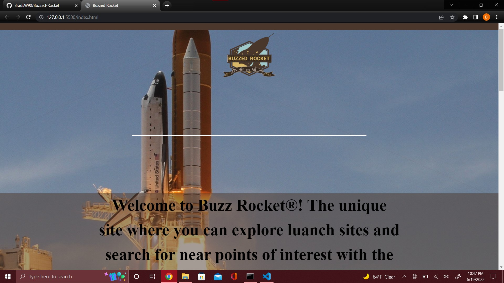

# BUZZ ROCKET

Buzz Rocket is a space tourism website at its initial stage of development where user will be able to search for space launches worldwide and at the same time will be able to search for any nearby point of interest. The webpage provides you with visual experience with the helo of launch cards and maps for the location you are searching for and also saves the search history for future reference.
In future development of the webpage , user will be able to share location with friends to join them for space launch, adding more point of interest to cater to different spectrum of customers. We would also add navigation from your current location to the space launch destination as well as nearby point of interest. Feature will be added to publish your journey in social media e.g. facebook or instrgram or personnal blog.There will be comments section added to the website inviting feedback how to improve the webpage.

## Authors

[@Bradley Woodle](https://github.com/BradsW90)
[@Davon Webb](https://github.com/Davon95)
[@debajitboro](https://www.github.com/deb-boro)
[@Esteban Leonardo](https://github.com/EstebanLVB)

## Features

A space tourism website with space launch location , date and point of interest search.

## Tech Stack

html
bulma.io CSS Framework (https://bulma.io/)
The Space Devs API (https://thespacedevs.com/)
MapBox API (https://www.mapbox.com/)
JavaScript

## Link to Deployment

Copy and paste below link in any browser:

## Screenshot

[https://bradsw90.github.io/Buzzed-Rocket/](https://bradsw90.github.io/Buzzed-Rocket/)
